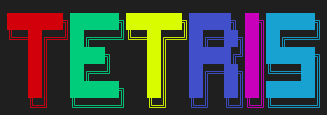

## 1. About _Nyx-Tetris_

### Overview
Tetris is a classic puzzle game where players manipulate falling tetrominoes (geometric shapes composed of four square blocks) to create and clear horizontal lines on the game board. The goal is to prevent the stack of blocks from reaching the top of the screen. Tetris is often named **_one of the greatest video games_**.

### Purpose
The Nyx-Tetris project was created to explore the capabilities of **vanilla C++** in building a console-based graphical game on _Linux_. The goal was to **avoid** using external libraries like SFML or SDL, emphasizing the _use of minimalistic system libraries_ to handle inputs and control the game flow.

## 2. Development Process
### Tools and Libraries Used:
- **C++**: The primary programming language used for development.
- **termios.h**: For handling **non-canonical input**, allowing real-time user interactions without needing to press Enter.
- **unistd.h**: Used for system-level operations such as _read() and write()_
- **Linux Terminal**: The game is designed to run directly in the **xterm-based** GNU/Linux terminal environment.

### Features:
- **Custom built psedo-random algorithm** using LFSR's.
- Ability to forge **Custom Tetriminoes** or use **Random Tetriminoes**.
- **Memory-efficient** ways to store the Tetris backend.
- Simple and **bug-free** implementation of Collision Detection and Rotation.
- **8-bit Color** support, just like the original versions of Tetris.
- Out-of-box thinking in the making of most features.
- **Dynamic updation** of Content on screen without re-printing the whole buffer/screen, only parts that are updated.
- Completely customizable Game like Height, Speed and Scoring Critera.
- A nice indication of Next Block, which can be disabled hinting on highly customizable Game play.

### Challenges:
- A working random function that has optimal entropy and runs smoothly. (Current implementation uses 16-bit entropy LFSR algorithm)
- A Collision function that actually solves edge-cases, rather than just catching them.
- A way to only update the part of screen that have been updated. (It has allowed us to use 8-bit colors, while also make game play more smooth as less content has to be printed on buffer/screen)
- Keeping in view the above point, the next major challenge was to Clear line and dynamically Update the Game rows.
- To design an aesthetic User Interface for game keeping in view the limiations of Terminal-Emulators.

## 3. Final Status
The project is almost complete, with the following achievements and limitations:

### Achievements:
- Animated Line Clearing, especially noticable when clearing four lines.
- The random number generator is working as expected, giving predictable random values.
- A blazzing fast Rotation and Collision Detection algorithm which handles all edge cases greatly.
- The fallen blocks are added to the main Game Array for Collision Detection.
- A very good User Interface for Tetris

### Limitation
- There are some UI elements missing.
- The Game sometimes behaves a bit odd because of Dynamic updation of content.